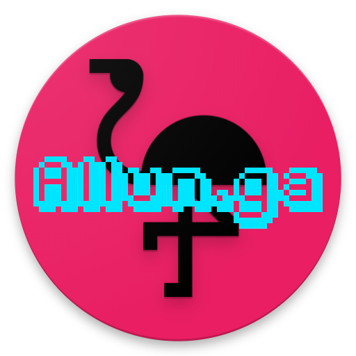

 

# Allun.ga

Modern URL shortner - succint UX, elegant Material-UI

## Something about us

Allun.ga is an italian {open source, succint, vaporwave, material-design} URL shortner, written in ReactJS.

Allun.ga's name come from an italian verb which means 'to extend', we choose it to create the domain hack and obviously the wordplay.

Allun.ga is against racism, women harassment, pineapple bacon pizza and, of course, light themes in IDEs.

Feel free to use Allun.ga to shorten your url, but remember that we are in beta, so be patient if something doesn't work properly: open an issue on our Github repo, we'll work on it ;)

## Some technical details

- as of now, each submitted URL is hashed in CRC32: with ~3000 links, probability of collision is 1 in 1000; as a starting point it's not bad, later we'll have to change it
- hosted on firebase: we don't use complex SQL queries, and each doc written on firestore is really small

## Setup

First install npm dependencies:

```sh
npm install
```

Then install firebase-cli (you'll need a google account):

[follow these steps](https://firebase.google.com/docs/web/setup)

## Running on localhost

First build the webapp:

```sh
npm run build
```

Then serve it from firebase-cli:

```sh
npm start
```

## Running on Firebase

Remember to build the webapp:

```sh
npm run build
```

Then upload on firebase (remeber to setup it!)

```sh
npm run deploy
```
